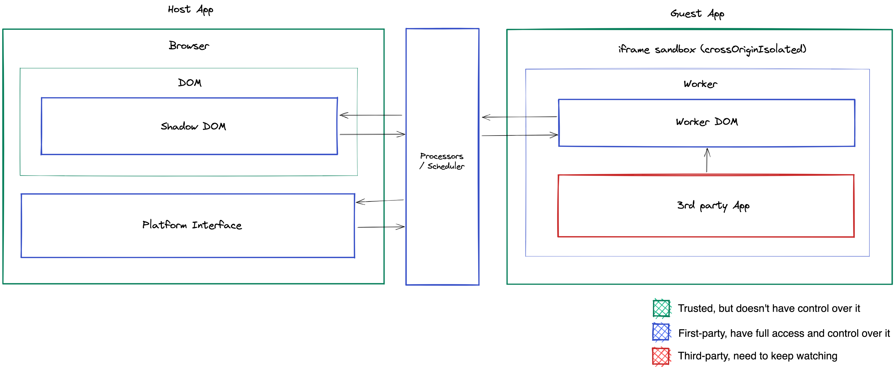

# Brane Project Explanier

Brane is an experimental project that aims to build secure, convenient and powerful third-party app environment based on modern web technologies. It's a set of building blocks for building **OS-grade experiences** include vendorizing an regular web app, publishing to a registry, installation, pre-loading apps, embedding widgets and smooth transition between apps and widgets

Brane's idea loosely follows the [Progressive Web App](https://web.dev/progressive-web-apps/) and [MiniApp Standardization White Paper](https://www.w3.org/TR/mini-app-white-paper/)

## Motivation

Web is very popular approch for building mobile apps today.

Still, there has been a lot of discussion about whether X can be implemented in on the web.

The [Progressive Web Apps](https://web.dev/progressive-web-apps/) is a well-known approach, actually can deliver most of platform native features  such as installation, offline support, payments, and push notifications that are available in modern browsers today. However, there are many limitations to providing an well-integrated experience with the platform, which tends to be avoided.

Using WebView and native bridge allows app to build experiences that are well-integrated with the platform. However, Android's WebViewClient and iOS's WKWebView are somewhat outdated and have their own limitations. WebView APIs are inconvenient to use and often conflict with platform-specific lifecycle model or security model.

As the business evolves and apps begin to scale horizontally, new patterns such as ["Micro Frontends"](https://micro-frontends.org/) and ["Mini Apps"](https://web.dev/mini-apps/) emerge. These are all for single, standalone app development and non of these can describe a usecase for running third-party codes.

Using trusted third-party codes may partially be able by static build tools like [Module Federation](https://webpack.js.org/concepts/module-federation/) by Webpack, or platform specific APIs such as [Trusted Web Activities](https://developer.chrome.com/docs/android/trusted-web-activity/) on Android.

But collaborating with *untrusted* third-party apps is absurd yet. Making it work with a good experience on the web (at least it's not iframe) seems very difficult. If anyone want to build a creative space for third-parties,  interactive ads, plugin systems, or own app stores, they need to consider a unique approach from the scratch to secure and to integrate with existing platform.

Brain starts from the desire to share some working and sensible building blocks for apps that want to build their own platforms today. Brane lifts up the responsibilities and feature limitations that are exclusive a few OS/browser vendors today, so offers to apps the opportunity to become itself a host environment for other apps.

## Initiative

- **Safe**: Running third-party apps can be a big security threat. Brane should provide the safe way to isolate apps.
- **User Experience**: Brane should not degrade the user experience while running isolated third-party apps. That means not only minimizing the performance overhead due to isolation, but also even if third-party apps are getting slow, they shouldn't affect the main UI interaction.
- **Vendor Netural**: Brane should be able to interoperate across multiple "super-apps" without having implementations tied to a specific vendor.
- **Modern Web**: Instead of designing a new system interface, Brane leverages the interfaces and security models Web already has today and constantly evolving. And gives power that users can provide themselves without being blocked to browsers implementation status.
- **Inclusive**: Brane goes beyond being transparent, keeping it open to anyone who wants to build and improve their own platform.

## Technical Details

### Isolation

### Multi-tasking

### Packaging

## Glossary

TBD

[Mini Apps]: https://web.dev/mini-apps/
